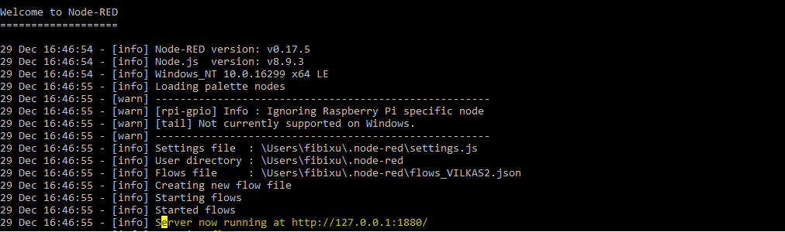

## Chap.1 万万没想到，我这一世英名葬送在了地图坑里
继上次搭建完框架得到了个粗糙的demo以后，我天真地以为我离真理的距离简直就只有一步之遥了。基本的图形组件试了个遍没什么。  
想着我还有些模拟的地理数据没有做可视化，数据信息的内容放在名为location的属性之下，具体格式如： 
```json
{
  "location": {
   "lat":12.345,
   "lon":56.789
  }
 }
 ```
一个很自然而然想法萌生了---用地图来展示相关信息。但！万万那没想到，一进地图的坑，卡了10天都没出坑。（部分原因是圣诞节让我懒惰[写不出来就让圣诞节背锅哈哈哈哈]，没有做功课)。  
关于基于地图的信息可视化，Power BI上的Map工具给我留下了用户友好简单易用的好印象。只要使用直接的经纬度数据对就能在地图上对位置定位并展示。逻辑惯性让我想当然了，天真地以为所有的地图插件都一样”单纯”。
首先，在Grafana的标准可视化工具中是不包括地图相关的工具的， 但在插件库中官方发布了一款名为World Map Pannal基于地图可视化的工具，符合我的需求看起来效果也不错。    
在简单地下载安装了这个插件后，我发现事情并没有想象简单。该工具和我的可视化框架最大的冲突是：  
**World Map Pannel并不支持通过经纬度数据对 e.g. (latitude, longtitude)在地图上定位与可视化， 其支持的数据格式有且仅有两种：Country/State Code或geohash**。 
以下从官方文档中摘出的这句话很好地的解释了这两种数据类型。  
> There are currently two ways to connect data with points on a map. Either by matching a tag or series name to a **country code/state code** (e.g. SE for Sweden, TX for Texas) or by using **geohashes** to map against geographic coordinates。   
#### Tips:睁大双眼，认真审题（这屎一样的文档）
Grafana和InfluxDB的文档大概是我有生以来看到过写的最逻辑混乱的文档之一了，吐槽请见[上篇博客](https://segmentfault.com/a/1190000012514865)。
在这新年之际，我要邀请大家继续欣赏出自Grafana官方WorldMap Panel的[documentation](https://github.com/grafana/worldmap-panel)。 说实话我一口气看了三遍后竟然比看第一遍时还要混乱。文档以table data, time series data和json为data source的介绍相关配置实在是相当混乱。以我的构架为例：首先，使用influxdb得到的数据照理说应该是time series data吧？毕竟人家influxdb号称time-series数据库，以写入数据库时的时间戳作为表格的唯一索引。 然而最后使用的配置方法竟然归档在table data下(influxdb: 我不要面子的哦)；
其次"time-series data"这个称谓也许还能够直观地理解是以时间戳为索引的数据（更有甚者我这样的理解其实是错误的），那么“table data”该如何去理解呢？"time-series data"难道不是以表格的形式组织排列储存的吗？至于“json”就更为模糊了，是以json为格式的数据？还是通过json的形式传递的数据？ 那么json这种格式的数据就不能同时是"time-series data"或"table data"吗？这三种类型的数据不具备互斥性，由此可见这种分类方法是不科学的。 
我个人主观认为正确的分类方法正如文档开头所说，我在本文的第一章节也引用了这句话:
> There are currently two ways to connect data with points on a map. Either by matching a tag or series name to a **country code/state code** (e.g. SE for Sweden, TX for Texas) or by using **geohashes** to map against geographic coordinates.   

> 注解：对于code： 可以使用grafana预先定义的code， 也可以自定义一些code并用json/jsonp方式导入;  
       对于geohash: 主要是为了支持elasticsearch， 但是对于influxdb， 可以人工添加geohash的tag，并将数据看作是表格读取geohash tag中的内容； 

**“以country code和geohash为区分，详述在不同数据库下针对这两种数据源的配置方法”**---用这样的方法组织文档，一目了然，结构清晰；读者按图索骥，效率大大提高，至少好过现在的文档。而全文档如此重要的一句话，竟然放在一个毫不起眼的角落。恕我实在无法理解撰写者的意图。

## Chap.2 各种绞尽脑汁花式变换关键词问google+欲罢不能看文档之后的结果
为了解决这个如鲠在喉的数据匹配问题，几种可能的解决方法一番折腾后初现原形：  
~~1. 在原始数据中人工硬是添加个country code field或geohash field；~~  
最容易想到的方法。简单粗暴快捷！但是考虑到这样的方法并不能适配所有的IoT设备，且大部分的GPS产生的数据还是经纬度。排除排除！  
~~2. 在Telegraf中添加能够对经纬度数据对做处理并产生geohash的plug-in；~~  
可惜我并没有找到这样可以直接使用的plug-in。转念想到可以自己开发plug-in,但是对我而言时间，学习成本太。高。（Golang小白,geohash算法不了解）。两个字：排除！    
P.S:有兴趣的朋友可以看看telegraf的文档，他们是欢迎各种形式的plugin PR的。暗中观察，这样的plug-in应该要归在processor plug-in一类中。而目前官方只在这类中给了个printer。基本等于没什么卵用，就是在cmd里打印下数据流。亟待小伙伴填坑！  
ref:   
~~3. 使用Kapacitor对流出数据库的数据分析处理，后而送至可视化终端；~~
Kapacitor是influxdata四个开源核心产品之一（TICK stack, K--Kapacitor)，可以对数据进行相应的分析处理，比如使用机器学习模型处理分析数据。具体其他功能不是特别清楚没做仔细调研，有兴趣的同学移架[这里]()。  
至于排除的原因和2类似，没有可用的脚本，开发成本太高。  
~~4. 使用[node-influx](https://github.com/node-influx/node-influx)和[node-geohash](https://github.com/sunng87/node-geohash)等开源插件, 后端语言（如node.js)处理,向数据库直接添加geohash tag并写入值；~~  
看起来似乎是个物美价廉的正经解决方法。不过由于本文讨论的是实时IoT数据的可视化，可能每分钟就会向数据库内写入大量的数据，如果在数据存储后再对数据进行操作，则要频繁地调用数据库I/O进行读写操作,将已经存入的数据记录逐条处理并写回，增加了数据库负担。因此排除。
ref[1]: https://community.influxdata.com/t/mapping-influx-data-to-maps/341/2  
5.  使用Node-Red对数据流向管理，在数据存入数据库之前利用已有的集成块调用接口计算geohash以减轻对数据库的负担。
Node-Red为开源项目，主要用于可视化IoT数据的流向并且对数据流向进行管理。 依赖于活跃node.js社区，拥有大量可用资源的强大的社区支持。 既能有效地将数据从源头历经的各个技术栈以流程图的形式表达出来，又能对数据流进行简单管理，处理语言使用javascript，对前端工程师十分友好， node.js在背后的强大支撑更让该工具如虎添翼。   
权衡之后，决定采取最后一种方案。

## Chap.3 解决方案详细步骤
### 配置Node-Red
prerequisite: **node.js**  
tips:用了一个插件叫做chocolately, 从此Windows也拥有了软件包管理工具，命令行安装package不是梦！
打开 windows cmd 并输入： 
`choco install nodejs-lts`
* 安装Node-Red：   
`C:\WINDOWS\system32>npm install -g --unsafe-perm node-red`
*  安装至关重要的geohash node：   
`用户app路径\npm\node_modules\node-red>npm install node-red-node-geohash`
* 运行node-red：
`用户app路径\npm\node_modules\node-red>node-red`
* cmd提示成功信息

* 用浏览器打开途中高亮地址，进入node-red的用户界面---新世界大门打开，噔噔！


### 思考一个问题
既然已经确认使用Node-Red的geohash-node作为解决方案，那么这个时候要思考一个问题：
**是在数据存入数据库之前增加geohash的属性还是之后?**

### 在Red-Node上创建data flow
location-preprocessor:    
```javascript
//The main purpose of this snippet is to extract the location info from msg.payload and then put it to msg.location to get the calculated geohash. 
var message=JSON.parse(msg.payload);
if(message[0].location!==null)
{
  msg.location={
      "lat":message[0].location.lat.toString(), 
      "lon":message[0].location.lon.toString(),
      "precision":"8"
  };
//msg.location=message;
}
return msg;
```
location-afterprocessor:  
```javascript
//The main purpose for this snippet is to put the geohash property into msg.payload which is then transferred by mqtt-broker via certain topic
if(msg.location.geohash!==null)
{
   var message=JSON.parse(msg.payload);
   message[0].geohash=msg.location.geohash;
   msg.payload=JSON.stringify(message);
   msg.topic="sensors/wrap_geohash";
}
return msg;
```
### 检查数据库内的数据格式是否正确
到这里，数据应该安然无恙地被telegraf简单处理后存入数据库。这时对数据库进行简单的操作检查数据是否如自己预期地被写入了指定数据库。


### 配置grafana World Map Panel settings


